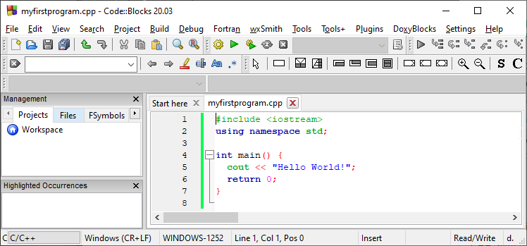

# Einführung in C++

Um C++ zu verwenden, brauchst du zwei Dinge:

-   Einen Texteditor, wie Notepad, um C++ Code zu schreiben.
-   Einen Compiler, wie GCC, um den C++-Code in eine Sprache zu übersetzen, die der Computer versteht.

Es gibt viele Texteditoren und Compiler zur Auswahl. In diesem Tutorial verwenden wir eine IDE (siehe unten).

## C++ IDE installieren

Eine IDE (Integrated Development Environment) wird zum Bearbeiten UND Kompilieren des Codes verwendet.

Beliebte IDEs sind Code::Blocks, Eclipse und Visual Studio. Diese sind alle kostenlos und du kannst sie sowohl zum Bearbeiten als auch zum Debuggen von C++-Code verwenden.

Hinweis: Webbasierte IDEs können ebenfalls funktionieren, aber ihre Funktionalität ist begrenzt.

Wir werden in diesem Tutorial Code::Blocks verwenden, das unserer Meinung nach ein guter Ausgangspunkt ist. Du findest die neueste Version von Code::Blocks unter [http://www.codeblocks.org/](https://www.codeblocks.org/downloads/binaries/). Lade die Datei `mingw-setup.exe` herunter, die den Texteditor mit einem Compiler installiert.

## C++-Schnellstart

Erstellen wir deine erste C++-Datei.

Öffne Code::Blocks und gehe zu **Datei > Neu > Leere Datei**.

Schreibe den folgenden C++-Code und speichere die Datei als `myfirstprogram.cpp` **(Datei > Datei speichern unter)**:

### myfirstprogram.cpp

```c++
#include <iostream>
using namespace std;

int main() {
  cout << "Hello World!";
  return 0;
}
```

Mach dir keine Sorgen, wenn du den obigen Code nicht verstehst – wir werden ihn in späteren Kapiteln im Detail besprechen. Konzentriere dich jetzt darauf, wie du den Code ausführst.

In Code::Blocks sollte es so aussehen:



Gehe dann auf **Build > Build and Run**, um das Programm auszuführen. Das Ergebnis sieht in etwa so aus:

```cmd
Hello World!
Process returned 0 (0x0) execution time : 0.011 s
Press any key to continue.
```

**Herzlichen Glückwunsch!** Du hast nun dein erstes C++-Programm geschrieben und ausgeführt.
