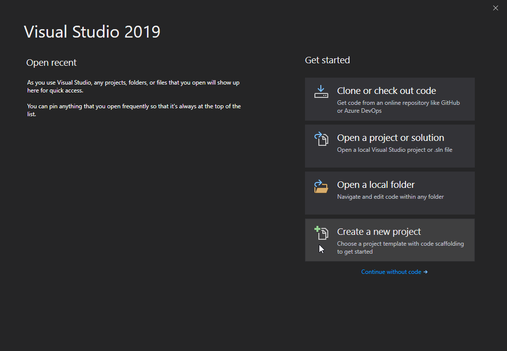
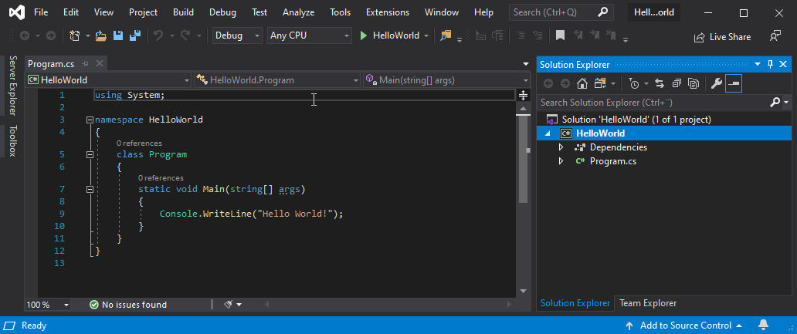

# Loslegen mit C#
Um richtig Programmieren zu könne, brauchen wir eine IDE (Eine so genante: "**Integrierte Entwicklungsumgebung**", die Programmierern dabei hilft, Programmcode effizient zu entwickeln.) doch wie bekommen wir die?

# C# IDE
Der einfachste Weg, um mit C# zu beginnen, besteht darin, eine `IDE` zu verwenden.  
Eine IDE (Integrierte Entwicklungsumgebung) wird zum Bearbeiten und Kompilieren von Code verwendet.  
In diesem Tutorial, werde wir Visual Studio Community verwenden, es ist kostenlos erhältich und kommt direkt von Microsoft: [https://visualstudio.microsoft.com/vs/community/](https://visualstudio.microsoft.com/vs/community/).  
Anwendungen die in C# geschrieben sind nutzen das .NET Framework, also ist es sinnvoll Visual Studio zu benutzen, da das Programm, das .NET Framework und die Sprache, alles von Microsoft entwickelt wurde.  

# C# Installieren
Nachdem der Visual Studio installer runtergeladen und installiert wurde, wähle unter den Installation möglichkeiten: "**.NET desktop entwicklung**" aus, und klicke auf: "**Änderungen installieren**":
  

Sobald die Installation vollendet ist, klicke auf **Starten** um mit Visual Studio und C# los zulegen.  
Auf dem Startbildschrim, wähle "**Erstelle ein neues Projekt**":  
  

Wähle "**Konsolen-App (.NET Framework)**" von der Liste aus und klicke auf: "**Weiter**".  
  


Gebe einen Namen für dein Projekt ein, und klicke auf den: "**erstellen**" button:
  

Visual Studio wird für dich alles automatisch erstellen:
  

Der Code sollte ungefähr so aussehen:

### Program.cs
```C#
using System;

namespace HelloWorld
{
  class Program
  {
    static void Main(string[] args)
    {
      Console.WriteLine("Hello World!");    
    }
  }
}
```

Führe das Programm einmal aus, in dem du die **F5** Taste auf deiner Tastatur drückst (oder du klickst auf: "**Debug**" **->** "**Start Debugging**"). Das wird das Programm kompilieren und deinen Code ausführen. Das Ergebnis sollte ungefährt so aussehen:
```text
Hello World!
C:\Users\Username\source\repos\HelloWorld\HelloWorld\bin\Debug\netcoreapp3.0\HelloWorld.exe (process 13784) exited with code 0.
To automatically close the console when debugging stops, enable Tools->Options->Debugging->Automatically close the console when debugging stops.
Press any key to close this window . . . 
```
**Herzlichen Glückwunsch!!!** Du hast grade dein erstes C# Programm ausgeführt.  


  
Weiter geht es mit: [C# Syntax](Syntax.md)
